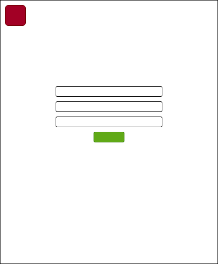

Лабораторная работа 2. Stateless HTTP-протокол и его реальное применение.

Ход работы:
 
  1)
  формы логина и регистрации практически одинаковые ,только в форме авторизации отсутсвует ввод имени,как при регистрации.После ввода неправильного логина или пароля заканчивается работа php кода и производится переход на пустую страницу,где написано "Такого пользователя не существует".После авторизации на главной появляется кнопка выхода и личного кабинета,а также перед этим есть надпись Привет <name>.Кнопка выход удаляет куки авторизовавшегося пользователя.
  
  2)
  неавторизированный пользователь
  

  авторизированный пользователь
  
  
  форма регистрации
  
  
  форма авторизации
  
  
  личный кабинет
  
  
  после успешной регистрации
  
  
  ошибка авторизации
  
  
  3)
  
  
  4)
  Честно говоря не уверен то ли это,что нужно,но вот
  
  
  
  получаем ,с помощью строчек вставив их после 18 строчки в файле /phplab/auth.php
  
  print_r($user);
	 exit();
  
  5 и 6)
  
  все файлы проекта в папке project
